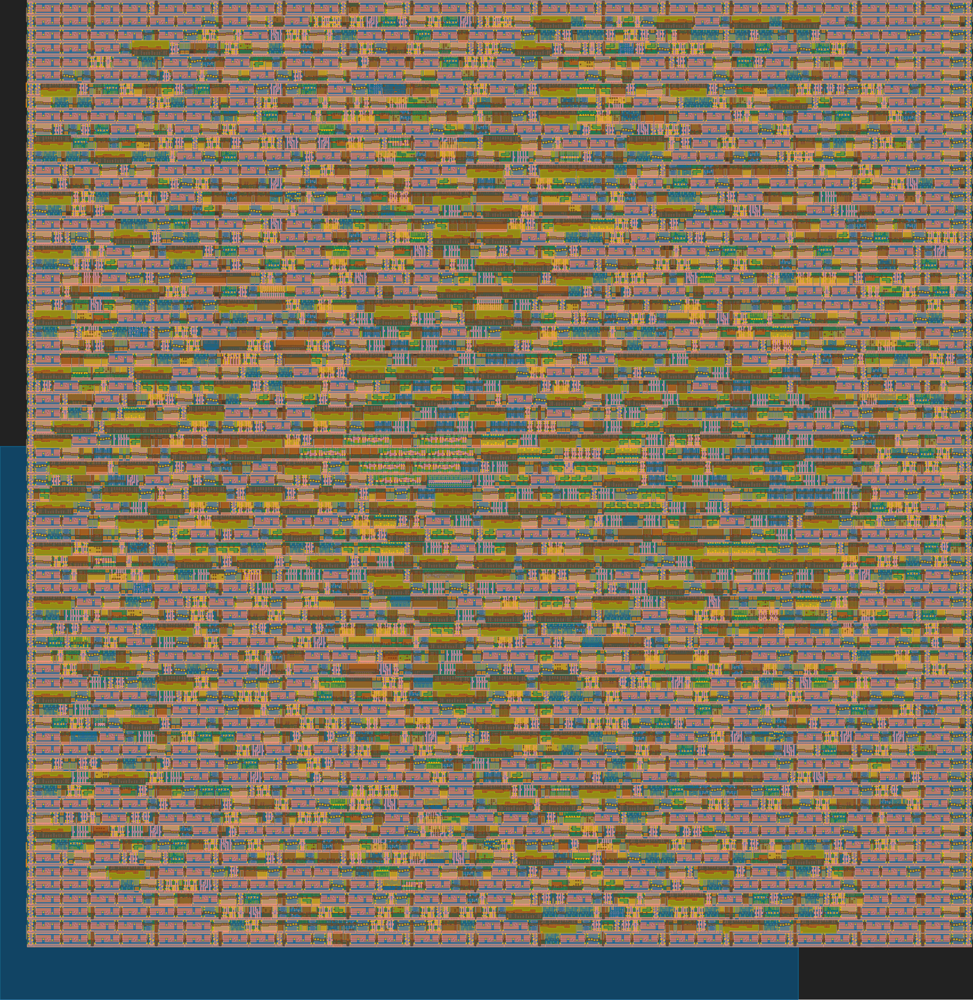
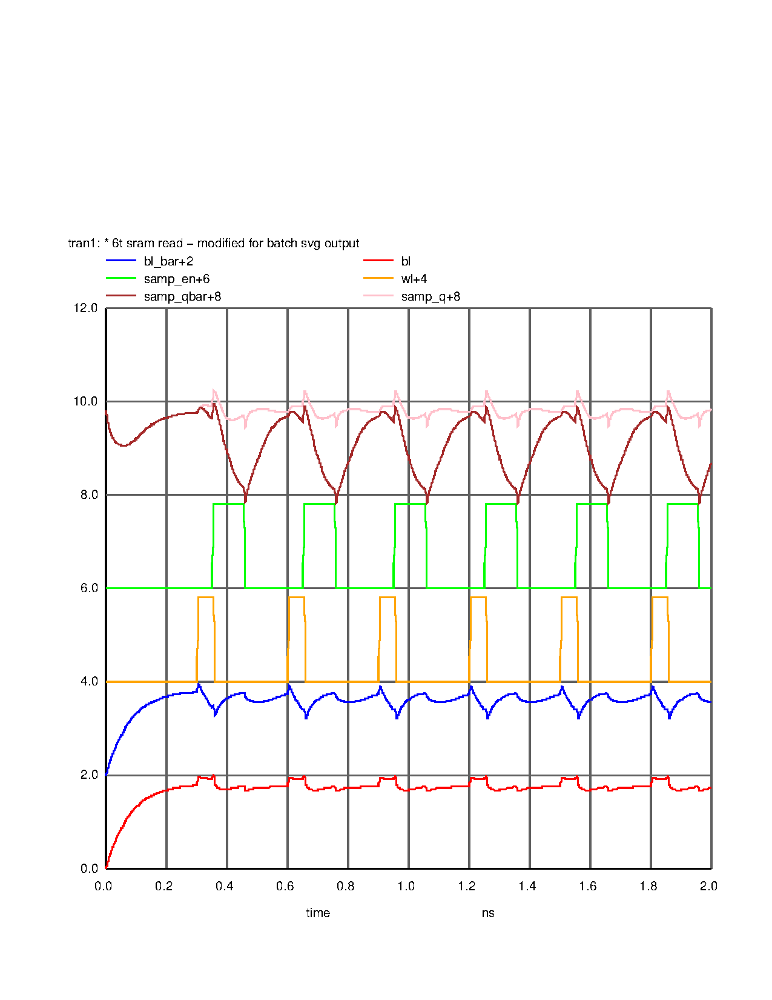

<div align="center">

# TensorCore-FPGA

> A high-performance LLM accelerator featuring Systolic Arrays and Vector Processing Units, targeting Xilinx Zynq FPGAs and ASIC (TinyTapeout/SKY130).

[](https://opensource.org/licenses/Apache-2.0)
[](https://www.xilinx.com/products/silicon-devices/soc/zynq-7000.html)
[](https://tinytapeout.com)
[](#verification-results)

</div>

## Overview

TensorCore-FPGA is a hardware accelerator architecture optimized for Large Language Model (LLM) inference. It implements the core computational kernels required for transformer models:

- **Matrix Multiplication**: Systolic Array with configurable tile sizes
- **Attention Processing**: FlashAttention-style Softmax with online normalization  
- **Layer Normalization**: L2 normalization for transformer layers

## TinyTapeout ASIC Results

The project includes a **2x2 Systolic Array** design hardened for TinyTapeout:

| Metric | Value |
|--------|-------|
| **Cells** | 2,872 |
| **Area** | 42,826 μm² |
| **Utilization** | 49.4% |
| **Clock** | 50 MHz |
| **Power** | ~79 μW |

### GDS Layout



### Verification Status

| Check | Status |
|-------|--------|
| DRC | ✅ Passed |
| LVS | ✅ Passed |
| Antenna | ✅ Passed |
| Setup Timing | ✅ 2.34ns slack |
| RTL Tests | ✅ 6/6 passed |

---

## SPICE Simulations

SRAM cell characterization using ngspice:

### 6T SRAM Read Waveform



---

## Installation

### System Requirements

- **OS**: Ubuntu 22.04+ / macOS
- **Python**: 3.10+
- **RAM**: 8GB+ recommended

### Quick Install (Ubuntu)

```bash
# Install EDA tools
sudo apt update
sudo apt install -y iverilog verilator yosys ngspice magic netgen klayout

# Install Python packages
pip install cocotb pytest librelane gdstk

# Install PDK (for TinyTapeout)
pip install volare
volare enable sky130 --pdk-root ~/.volare
```

### Verify Installation

```bash
# Check all tools
yosys --version       # >= 0.9
verilator --version   # >= 4.0
ngspice --version     # >= 36
magic --version       # >= 8.3
```

---

## Directory Structure

```
TensorCore-FPGA/
├── src/                     # RTL Source Files
│   ├── core/                # Original TensorCore (12 modules)
│   │   ├── TensorCore.v     # Top-level processor
│   │   ├── Control.v        # Tiling state machine
│   │   ├── PE.v, PE_Synth.v # Processing Elements
│   │   ├── SA_MxN.v         # Systolic Array
│   │   └── VPU.v            # Vector Processing Unit
│   ├── tt/                  # TinyTapeout Design
│   │   ├── tt_um_tensorcore.v      # TT top module
│   │   ├── ProcessingElement.v     # 8-bit MAC
│   │   └── SystolicArray2x2.v      # 2x2 array
│   └── include/             # Verilog headers
├── test/                    # Cocotb Tests
├── model/                   # Behavioral Models
│   ├── spice/               # SRAM SPICE circuits
│   └── systemc/             # SystemC models
├── vivado/                  # Xilinx FPGA flow
├── scripts/                 # Build & verification scripts
├── docs/                    # Documentation
└── tt/                      # TinyTapeout support tools
```

---

## Running Tests

### RTL Simulation (Cocotb)

```bash
cd test
make clean && make
```

**Expected Output:**
```
** TESTS=6 PASS=6 FAIL=0 SKIP=0 **
```

### Yosys Synthesis Check

```bash
yosys scripts/synth_check.ys
```

### SPICE Simulation

```bash
cd model/spice
ngspice -b sram_6t_read_svg.cir    # Batch mode with PNG output
ngspice sram_6t_read.cir            # Interactive with waveforms
```

### SystemC Simulation

```bash
cd model/systemc/sa_model
g++ -std=c++17 testbench.cpp -o testbench -lsystemc
./testbench
```

---

## TinyTapeout Hardening

### Prerequisites

```bash
pip install librelane volare
volare enable sky130 --pdk-root ~/.volare
```

### Run Hardening

```bash
python3 tt/tt_tool.py --create-user-config
python3 tt/tt_tool.py --harden           # Full ASIC flow
python3 tt/tt_tool.py --create-png       # Generate layout image
python3 tt/tt_tool.py --print-stats      # Show metrics
```

### Verify Design

```bash
export PDK_ROOT=$HOME/.volare
bash scripts/magic_drc.sh     # Design Rule Check
bash scripts/netgen_lvs.sh    # Layout vs Schematic
```

---

## EDA Tools Status

| Tool | Status | Purpose |
|------|--------|---------|
| **Yosys** | ✅ Working | RTL Synthesis |
| **Verilator** | ✅ Working | RTL Linting |
| **ngspice** | ✅ Working | SPICE Simulation |
| **Magic** | ✅ Working | DRC/Layout |
| **Netgen** | ✅ Working | LVS Verification |
| **KLayout** | ✅ Working | GDS Viewer |
| **LibreLane** | ✅ Working | TT Hardening |

---

## Architecture

```
┌──────────────────────────────────────────────────────────────┐
│                        TensorCore                            │
├──────────────────────────────────────────────────────────────┤
│  ┌────────────┐    ┌─────────────────┐    ┌────────────┐     │
│  │  Control   │───▶│   Systolic      │───▶│    VPU     │     │
│  │  (Tiling)  │    │   Array (MxN)   │    │ (Softmax)  │     │
│  └────────────┘    └─────────────────┘    └────────────┘     │
│        │                   │                    │            │
│        ▼                   ▼                    ▼            │
│  ┌──────────────────────────────────────────────────────┐    │
│  │                    Memory Subsystem                  │    │
│  └──────────────────────────────────────────────────────┘    │
├──────────────────────────────────────────────────────────────┤
│  ┌─────────────┐                      ┌──────────────────┐   │
│  │ PerfMonitor │                      │  AXI4-Lite (PS)  │   │
│  └─────────────┘                      └──────────────────┘   │
└──────────────────────────────────────────────────────────────┘
```

### TinyTapeout 2x2 Systolic Array

```
        Weight     Weight
         Col0       Col1
           │          │
           ▼          ▼
Data ─▶ [PE(0,0)] ─▶ [PE(0,1)] ─▶
Row0       │          │
           ▼          ▼
Data ─▶ [PE(1,0)] ─▶ [PE(1,1)] ─▶
Row1       │          │
           ▼          ▼
        Result     Result
```

---

## Performance Metrics

### TinyTapeout Design (50 MHz)

| Metric | Value |
|--------|-------|
| MAC Operations | 4 per cycle |
| Throughput | 200 MMAC/s |
| Wire Length | 39,062 μm |
| Setup Slack | 2.34 ns |
| Hold Slack | 0.108 ns |

---

## Contributing

Contributions and feedback are welcome!

1. Fork the repository
2. Create a feature branch
3. Run tests: `cd test && make`
4. Submit a pull request

---

## License

Licensed under the Apache License, Version 2.0 - See [LICENSE](LICENSE) for details.

## Acknowledgments

- [TinyTapeout](https://tinytapeout.com) for ASIC fabrication platform
- [OpenROAD](https://openroad.readthedocs.io/) for ASIC flow
- [Xilinx/AMD](https://www.xilinx.com/) for Vivado tools
- [Skywater PDK](https://github.com/google/skywater-pdk) for open-source PDK